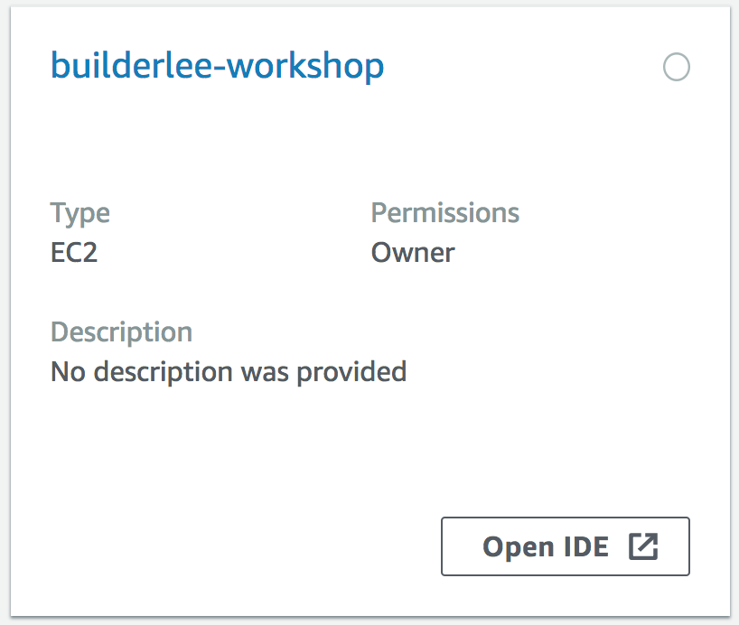
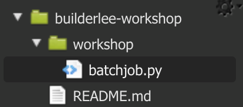
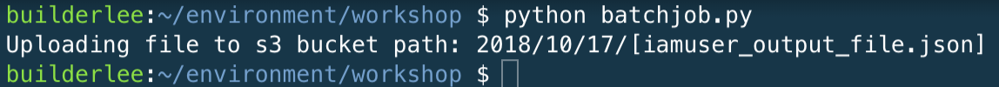
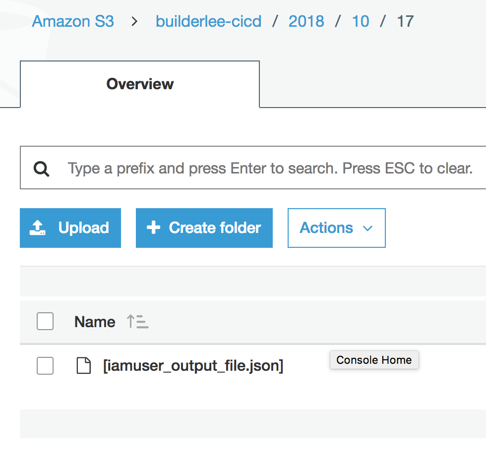
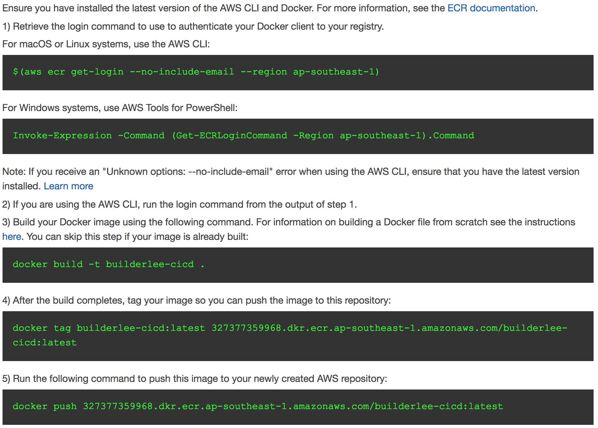
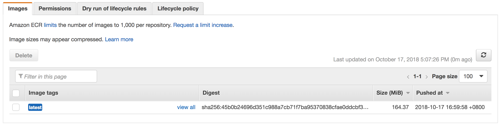

## Creating a Sample Python Application

We'll be building a sample Python application. When building application that run on AWS, most developers want to take advantage of our managed services in a programmatic manner. boto3, the AWS SDK for Python, allows Python developers to write software that makes use of services like S3.

### 1. Create Sample Application

This sample application will:

1.  Pull the daily data from your **[iamuser-raw-bucket]** S3 bucket delivered by Kinesis Firehose.
2.  It'll merge the various files delivered into a single line-delimited JSON file and upload it to **[iamuser-workbooks]** S3 bucket

The purpose of this application is simulate data processing and boilerplate code required to interact with S3 as part of an analytics processing workflow, rather than an actual analytics processing which is up to the developer to implement.

#### 1.1 Using the Cloud9 IDE Environment

We'll be using the Cloud9 environment created in **Part 0** of the lab.

1.  In the AWS Console, search for **Cloud9** under AWS Services and select **Cloud9**.

2.  Select **Open IDE** to use the Cloud9 IDE environment in a new tab:



3.  At the bottom of the screen, there will be a terminal window:


Cloud9 runs on an Amazon Linux distribution, which gives us a convenient bash shell to use.Check your current directory:

```
$ pwd
/home/ec2-user/environment
```

4.  Ensure your current directory is **/home/ec2-user/environment**, if it isn't, run the following command to change to it:

```
$ cd /home/ec2-user/environment
```

5.  Make a new working directory for our lab, and enter it:

```
$ mkdir workshop
$ cd workshop
```

6.  Create a python file:

```
$ touch batchjob.py
```

7.  The file will now appear on the file explorer pane on the left:



8.  Double click the file to edit the file in the visual editor:


9.  Paste the following sample code into the file:

```
import boto3
import datetime

## Configuration
now = datetime.date.today()
YEAR = str(now.year).zfill(4)
MONTH = str(now.month).zfill(2)
DAY = str(now.day).zfill(2)
PREFIX = YEAR+'/'+MONTH+'/'+DAY+'/'
WORKBOOK_BUCKET = 'builderlee-cicd' # replace with your S3 bucket name for [iamuser-workbooks]
OUTPUT_FILE = '[iamuser_output_file.json]' # replace with [iamuser_output_file.json]

## Instantiate S3 object via boto3
s3 = boto3.resource('s3')

f = open(OUTPUT_FILE, "a")
f.write("Output of my batch job!")

## Upload processed JSON to Workbook Bucket
wb_bucket = s3.Bucket(WORKBOOK_BUCKET)
print("Uploading file to s3 bucket path: " + PREFIX+OUTPUT_FILE)
wb_bucket.upload_file(OUTPUT_FILE, PREFIX+OUTPUT_FILE)
```

10. You'll need to change a number of parameters under the configuration:

- **WORKBOOK_BUCKET**: The name of your Workbooks bucket **[iamuser-workbooks]**
- **OUTPUT_FILE**: The name of your processed file to be uploaded back to S3 **[iamuser_output_file.json]**

11. Run the python script to test your batch job:

```
$ python batchjob.py
```

You should see an output similar to the screenshot below:



12. To validate the **[iamuser_output_file.json]** file has been uploaded to S3, run the following command or view the bucket via the AWS console:

```
$  aws s3 ls builderlee-cicd --recursive
```

Console:


### 2. Containerise Batch Job

#### 2.1 Create Container Repository

We will be building a docker container to run our batch job, which simplifies continuous development and deployment of our code. There are many benefits of using containers in general which we will not be diving deep into today, but one benefit with batch is that your code is no longer tied to the Amazon Machine Image (AMI) used to launch the batch job, but rather, self-contained inside a docker image which is decoupled from the underlying infrastructure.

To store these docker images, we will create an Elastic Container Registry which is backed by S3, offering us the same durability and cost efficient characteristics.

1.  In the AWS Console, search for **ECS** under AWS Services and select Elastic Container Service.

2.  Select **Repositories** on the left menu

3.  Select **Get started**

4.  Enter **[iamuser-repo]** as the **Repository name**

5.  Select **Next step**. You now have a private repository for your docker images:


6.  On the same page, there are also useful instructions displayed on how to authenticate, and push images into ECR:



#### 2.2 Create Containerised Batch Job

AWS Batch supports any job that can be executed as a Docker container. Containerising a Python script is relatively simple compared to a full blown web application, and provides many benefits as you have a self contained image then is built programmatically, and abstracts the underlying infrastructure from the runtime environment.

1.  Ensure you are in the lab working directory:

```
$ pwd
/home/ec2-user/environment/workshop
```

2.  Create a Dockerfile:

```
$ touch Dockerfile
```

3.  Double click **Dockerfile** to edit the file in the visual editor, and add the following code:

```
FROM amazonlinux:latest

RUN yum -y update
RUN curl -O https://bootstrap.pypa.io/get-pip.py
RUN python get-pip.py --user
RUN python -m pip install boto3
ADD batchjob.py /usr/local/bin/batchjob.py
RUN chmod a+x /usr/local/bin/batchjob.py
WORKDIR /tmp
USER nobody

ENTRYPOINT ["python", "/usr/local/bin/batchjob.py"]
```

4.  Build Docker image:

```
$ docker build -t [iamuser]-cicd/batchjob .
```

5.  After the build completes, tag your image so you can push the image to this repository:

```
$ docker tag [iamuser]-cicd/batchjob [awsaccountid].dkr.ecr.ap-southeast-1.amazonaws.com/[iamuser]-cicd:latest
```

6.  Run the following command to view your newly built and tagged image:

```
$ docker images
REPOSITORY                                                          TAG                 IMAGE ID            CREATED             SIZE
REPOSITORY                                                          TAG                 IMAGE ID            CREATED              SIZE
builderlee-cicd/batchjob                                            latest              3ceeb2224a10        About a minute ago   447MB
327377359968.dkr.ecr.ap-southeast-1.amazonaws.com/builderlee-cicd   latest              3ceeb2224a10        About a minute ago   447MB
```

7.  Before we can push our image to ECR, we need to get the login credentials with the following command:

```
$ $(aws ecr get-login --no-include-email --region ap-southeast-1)

WARNING! Using --password via the CLI is insecure. Use --password-stdin.
WARNING! Your password will be stored unencrypted in /home/ec2-user/.docker/config.json.
Configure a credential helper to remove this warning. See
https://docs.docker.com/engine/reference/commandline/login/#credentials-store

Login Succeeded
```

8.  Run the following command to push the image to ECR:

```
$ docker push [awsaccountid].dkr.ecr.ap-southeast-1.amazonaws.com/[iamuser]-cicd:latest
```

9.  To validate the image has been updated to ECR, search for **ECS** under AWS Services and select Elastic Container Service.

10. Select **Repositories**

11. Select **[iamuser-cicd]**

12. Observe that the image has been pushed to ECR:



**Note**: Record down the image destination of your push, as we will need to tell AWS Batch Job Definition which container to use in the next part of the lab. In my example, the image identifier is **327377359968.dkr.ecr.ap-southeast-1.amazonaws.com/builderlee-cicd:latest**

We're done! continue to [Part 2 : Running Batch Jobs with AWS Batch](./doc-module-02.md)
