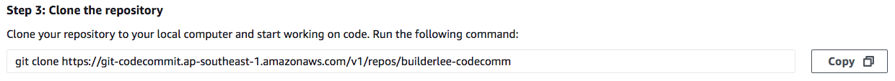
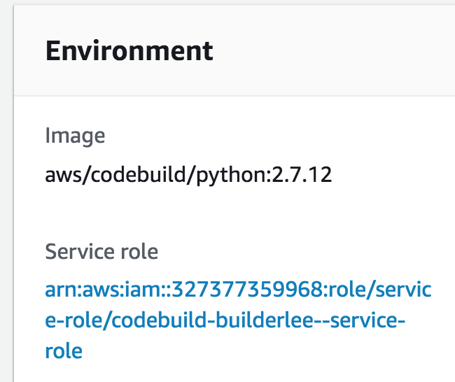
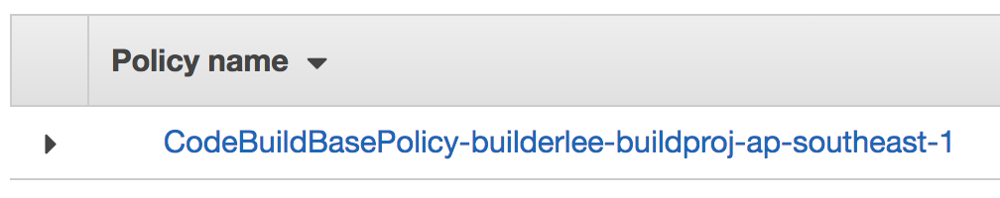
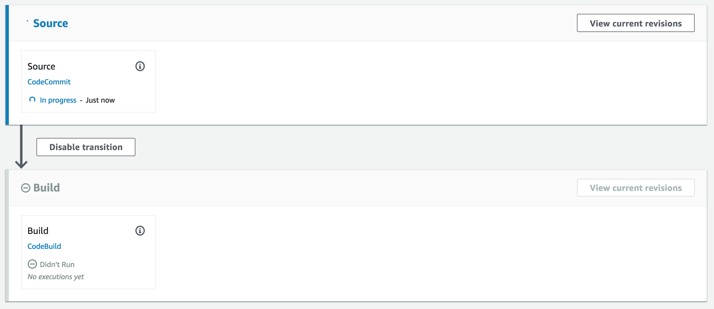
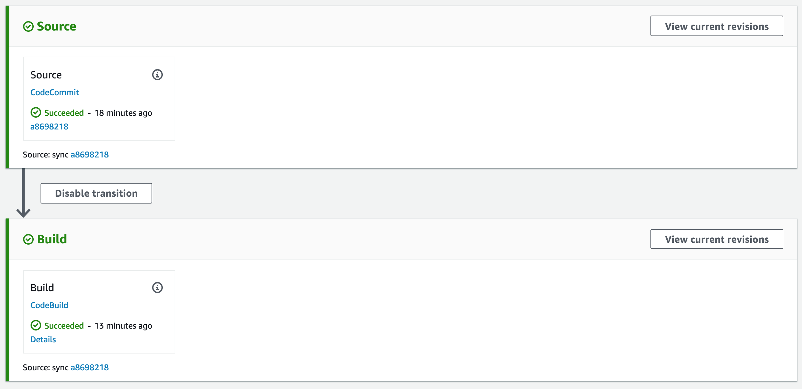
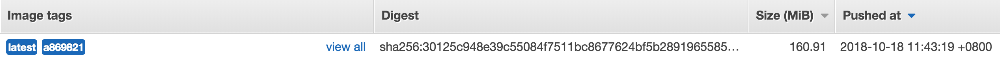

## Creating a CI/CD Pipeline for you Batch Job

Building out a CI/CD pipeline for your batch application can help reduce the operational effort in maintaining/enhancing your application by automating repetitive tasks.

AWS offers a set of services designed to enable developers and IT operations professionals practicing DevOps to rapidly and safely deliver software. Together, these services help you securely store and version control your application's source code and automatically build, test, and deploy your application to AWS or your on-premises environment. You can use AWS CodePipeline to orchestrate an end-to-end software release workflow using these services and third-party tools or integrate each service independently with your existing tools.

1.  **AWS CodeCommit**: AWS CodeCommit is a fully-managed source control service that makes it easy for companies to host secure and highly scalable private Git repositories. CodeCommit eliminates the need to operate your own source control system or worry about scaling its infrastructure. You can use CodeCommit to securely store anything from source code to binaries, and it works seamlessly with your existing Git tools.

2.  **AWS CodePipeline**: A job definition specifies how jobs are to be run. Think of it as a blueprint for the batch job which defines the resources required to run, ranging from vCPU, RAM, storage to the IAM permissions required so it can access other AWS Services programmatically. Job definitions can also be overwritten when submitted programmatically.

3.  **AWS CodeBuild**: AWS CodeBuild is a fully managed build service that compiles source code, runs tests, and produces software packages that are ready to deploy. With CodeBuild, you don’t need to provision, manage, and scale your own build servers. CodeBuild scales continuously and processes multiple builds concurrently, so your builds are not left waiting in a queue. You can get started quickly by using prepackaged build environments, or you can create custom build environments that use your own build tools. With CodeBuild, you are charged by the minute for the compute resources you use.

4. **AWS CodeDeploy**: AWS CodeDeploy is a service that automates code deployments to any instance, including Amazon EC2 instances and servers running on-premises. AWS CodeDeploy makes it easier for you to rapidly release new features, helps you avoid downtime during application deployment, and handles the complexity of updating your applications. You can use AWS CodeDeploy to automate software deployments, eliminating the need for error-prone manual operations, and the service scales with your infrastructure so you can easily deploy to one instance or thousands.

**Reference**: https://aws.amazon.com/products/developer-tools/

Here's the high level design of our CI/CD pipeline:

1. Create a CodeCommit repository to store our source code in. Changes to the source code will be the trigger for CodePipeline.

2. We will automate the build steps. Previously, this was building the Docker image with our Dockerfile and then pushing it to ECR. We will automate them by using a Build Specification file that CodeBuild will understand.

3. 

### 1. Create a code repository with AWS CodeCommit

#### 1.1 Create a AWS CodeCommit Repository

1. In the AWS Console, search for **codecommit** under AWS Services and select **CodeCommit**.

2. Select **Create repository**

3. Enter **[iamuser-codecomm]** as your **Repository name**

4. Select **Create**. 

5. You should see the following command provided by CodeCommit to clone your repo:



6. Now run the command in your Cloud9 IDE to clone the repo:

```
$ git clone https://git-codecommit.ap-southeast-1.amazonaws.com/v1/repos/[iamuser]-codecomm
```

7. Now copy our files from the previous lab into the new folder created for the repository:

```
$ cp -r ~/environment/workshop/* ~/environment/[iamuser]-codecomm/
```

8. Change to the new folder:

```
$ cd ~/environment/[iamuser]-codecomm/
```

9. Commit and push our projecet to the repository:

```
$ git add .
$ git commit -m "first sync"
$ git push
```

### 2. Automate Build Steps with AWS CodeBuild

#### 2.1 Add a Build Specification File to Your Source Repository

1. Add the Build Specification file:

```
$ touch buildspec.yml
```

2. Double click **buildspec.yml** to edit the file in the visual editor, and add the following code:

```
version: 0.2

phases:
  pre_build:
    commands:
      - echo Logging in to Amazon ECR...
      - aws --version
      - $(aws ecr get-login --no-include-email --region $AWS_DEFAULT_REGION)
      - REPOSITORY_URI=[ECR Repository URI]
      - COMMIT_HASH=$(echo $CODEBUILD_RESOLVED_SOURCE_VERSION | cut -c 1-7)
      - IMAGE_TAG=${COMMIT_HASH:=latest}
  build:
    commands:
      - echo Build started on `date`
      - echo Building the Docker image...          
      - docker build -t $REPOSITORY_URI:latest .
      - docker tag $REPOSITORY_URI:latest $REPOSITORY_URI:$IMAGE_TAG
  post_build:
    commands:
      - echo Build completed on `date`
      - echo Pushing the Docker images...
      - docker push $REPOSITORY_URI:latest
      - docker push $REPOSITORY_URI:$IMAGE_TAG
```

#### 2.2 Setup Cloud9 to Test CodeBuild Locally

Setting up CodeBuild locally can accelerates development and troubleshooting of Build Specification files. We will set this up and verify our build will work before configuring it to run on the cloud

1. Run git clone https://github.com/aws/aws-codebuild-docker-images.git to download this repository to your local machine:

```
git clone https://github.com/aws/aws-codebuild-docker-images.git
```

2. Lets build a local CodeBuild image for Python 2.7 environment. The Dockerfile for Python 2.7 is present in /aws-codebuild-docker-images/ubuntu/python/2.7.12

Run cd ubuntu/java/openjdk-8 to change the directory in your local workspace.

Run docker build -t aws/codebuild/java:openjdk-8 . to build the Docker image locally. This command will take few minutes to complete.

```
$ cd aws-codebuild-docker-images
$ cd ubuntu/python/2.7.12/
$ docker build -t aws/codebuild/python:2.7.12 .
```

3. Change back to the project folder

```
$ cd ~/environment/builderlee-codecomm/
```

4. Run the following Docker pull command to download the local CodeBuild agent:

```
$ docker pull amazon/aws-codebuild-local:latest --disable-content-trust=false
```

5. Run the following to download codebuild_build.sh script to run your local builds:

```
$ wget https://raw.githubusercontent.com/aws/aws-codebuild-docker-images/master/local_builds/codebuild_build.sh
$ chmod +x codebuild_build.sh
```

6. In order to run the CodeBuild locally, we need to pass in AWS credentials to the CodeBuild agent to authorise it to use AWS services. In the AWS Console, search for **IAM** under AWS Services and select **IAM**.

7. Select **Users**

8. Select the **Security credentials** tab

9. Select **Create access keys**

10. Select **Download .csv file**. Open the file and take note of **Access key ID** and **Secret access key**

11. Create an environment file:

```
$ touch env.txt
```

12. Double click **env.txt** to edit the file in the visual editor, and add the following configuration:

```
AWS_ACCESS_KEY_ID=[Your Access key ID]
AWS_SECRET_ACCESS_KEY=[Your Secret access key]
AWS_DEFAULT_REGION=ap-southeast-1
AWS_DEFAULT_OUTPUT=json
```

13. Execute the following command to run the local agent and build the sample web app repository you cloned earlier:

```
$ ./codebuild_build.sh -i aws/codebuild/python:2.7.12 -a /home/ec2-user/environment/artifacts -e env.txt
```

14. Your build should run successfully, with the last few lines being:

```
agent_1  | [Container] 2018/10/18 01:30:33 Phase complete: POST_BUILD Success: true
agent_1  | [Container] 2018/10/18 01:30:33 Phase context status code:  Message: 
agentresources_agent_1 exited with code 0
Stopping agentresources_build_1 ... done
Aborting on container exit...
```

15. You can verify the new image has been built and pushed to ECR through the console

#### 2.3 Create CodeBuild Project

1. In the AWS Console, search for **codebuild** under AWS Services and select **CodeBuild**.

2. Select **Create build project**

3. Enter the following details:

**Project configuration**
- Project name: [iamuser]-buildproj

**Source**
- Source provider: AWS CodeCommit
- Repository: [iamuser]-codecomm

**Environment**
- Operating system: **Ubuntu**
- Runtime: **Python**
- Runtime version: **aws/codebuild/python:2.7.12**
- Privileged: **Checked**

4. Select **Create build project**

5. Next we need to give CodeBuild permissions to push images to ECR by editing the Service role. Under your newly created build project, select **Build details**.

6. Scroll down and select the Service role indicated:


7. Select the policy attached to the role:


8. Select **Edit policy**

9. Select **JSON**

10. Add the block below between ### BEGIN ADDING STATEMENT HERE ### and ### END ADDING STATEMENT HERE ### to your IAM policy as an additional statement:

```
{
  "Statement": [
    ### BEGIN ADDING STATEMENT HERE ###
    {
      "Action": [
        "ecr:BatchCheckLayerAvailability",
        "ecr:CompleteLayerUpload",
        "ecr:GetAuthorizationToken",
        "ecr:InitiateLayerUpload",
        "ecr:PutImage",
        "ecr:UploadLayerPart"
      ],
      "Resource": "*",
      "Effect": "Allow"
    },
    ### END ADDING STATEMENT HERE ###
    ...
  ],
  "Version": "2012-10-17"
}

```

11. Select **Review policy**

12. Select **Save changes**

### 3. Create a CI/CD pipeline with AWS CodePipeline

#### 3.1 Configure AWS CodePipeline

1. In the AWS Console, search for **codepipeline** under AWS Services and select **CodePipeline**.

2. Select **Create pipeline**

3.  Enter the following details for  **Choose pipeline settings**
- Pipeline name: **[iamuser]-pipeline**

4. Select **Next**

5. Enter the following details for  **Add source stage**
- Source provider: **AWS CodeComit**
- Repository name: **[iamuser]-codecomm**
- Branch name: master

6. Enter the following details for  **Add build stage**
- Build provider: **AWS CodeBuild**
- Project name: **[iamuser]-buildproj**

7. Select **Next**

8. As we are running asynchronous batch jobs, we do not need to deploy our new Docker image to running servers everytime we build a new image. Select **Skip** twice

9. Select **Create pipeline**

10. On the next screen, observe that the new pipeline will try to pick up code from the CodeCommit repository and run for the first time:



11. When the build is complete, take note of the **Source sync**. This is the **Commit ID** from your CodeCommit repository, and allows you to trace the entire workflow from the initial commit to the built Docker image:


12. You can also see in the ECR repository that the new Docker image is tagged with the **Commit ID**:



We're done! continue to [Lab 3 : Running Batch Jobs with AWS Batch](./doc-module-03.md)